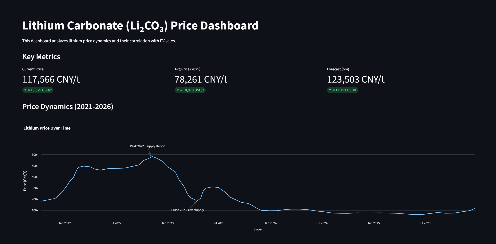
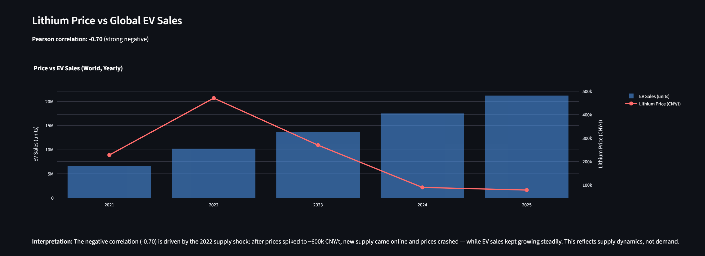
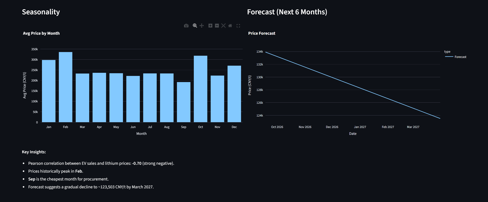

# Lithium Carbonate (Li₂CO₃) Price Dashboard

## Project Overview
This dashboard analyzes the price dynamics of lithium carbonate (Li₂CO₃) and their correlation with electric vehicle (EV) sales. It helps battery manufacturers and traders identify the best months to procure raw materials.

## Live Demo
[Open the dashboard](https://lithium-price-analysis.streamlit.app)

## Screenshots





## Data Sources
- **Lithium Prices:** Trading Economics (extracted via WebPlotDigitizer from public charts, 2021–2026).
- **EV Sales:** IEA Global EV Outlook via Our World in Data (2010–2025).

## Tech Stack
- Python (Pandas, NumPy)
- Plotly Express
- Streamlit
- WebPlotDigitizer

## Key Insights
- Strong negative correlation (-0.7) between EV sales and lithium prices. This is driven by the 2022 supply shock: after prices spiked to ~600k CNY/t, new supply came online and prices crashed — while EV sales kept growing steadily. The correlation reflects **supply dynamics, not demand**.
- Prices historically peak in February and October.
- September is the cheapest month for procurement.
- Forecast suggests a gradual decline to ~140,000 CNY/t by March 2027.

## Business Value
This tool helps procurement managers identify seasonal price dips and plan purchases during cheaper months. Based on historical seasonal averages, buying in September instead of February could reduce procurement costs by up to ~40% (seasonal range: ~190k vs ~340k CNY/t). Note: the 2022 supply shock inflates the February average.

## Methodology Notes
- **Forecast:** A simple linear extrapolation based on the last 12 months of data is used as a pipeline demonstration. In production, a seasonal model (SARIMA/Prophet) should be applied.
- **Currency:** Prices are in CNY/t, as China is the global benchmark for lithium. USD conversion uses a fixed average rate (7.2); in production, this should use a live FX API.
- **Data Extraction:** Lithium prices were extracted manually from public charts using WebPlotDigitizer, as the raw CSV is paywalled.

## How to Run

### Local setup

```bash
# Create a virtual environment (recommended)
python -m venv venv

# Activate it
venv\Scripts\activate          # Windows
# source venv/bin/activate     # Mac/Linux

# Install dependencies
pip install -r requirements.txt

# Launch the dashboard
streamlit run app.py
```
## Project Structure
- `analysis.ipynb` — data collection, cleaning, and analysis
- `app.py` — Streamlit dashboard
- `lithium_prices_raw.csv` — raw lithium price data
- `ev_sales_raw.csv` — raw EV sales data
- `lithium_ev_merged.csv` — merged dataset
- `correlation.csv` — Pearson correlation per region
- `seasonality.csv` — monthly average prices
- `forecast.csv` — 6-month price forecast
- `requirements.txt` — dependencies
- `LICENSE` — MIT license